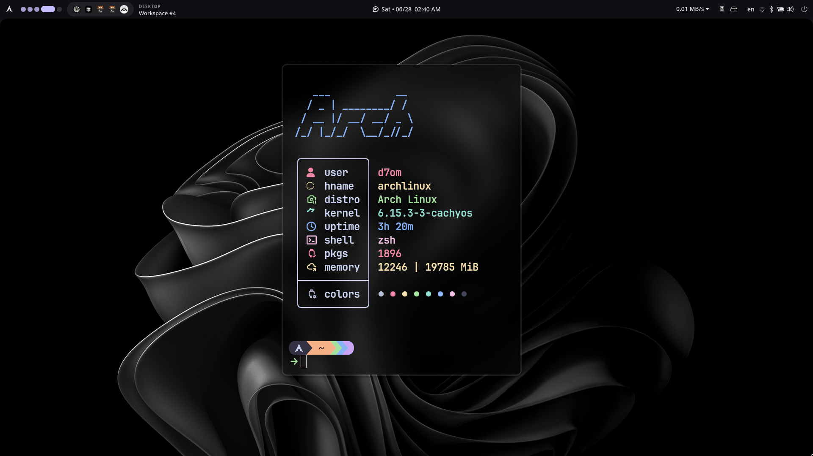

# d7shell

A modern desktop shell built with [Astal](https://aylur.github.io/astal/) and GTK4 for Wayland compositors.

**Status**: Work in Progress



## Features

- **Bar**: Customizable top/bottom bar
- **Dashboard**: System overview with notifications
- **App Launcher**: Searchable application launcher
- **Quick Settings**: Media controls and system toggles
- **System Monitoring**: CPU, GPU, RAM usage
- **Weather**: Current weather information

## Installation

```bash
# Clone and install
git clone https://github.com/d7omdev/d7shell.git
cd d7shell
bun install

# Run
bun run run
```

## Configuration

Edit `option.ts` to customize:

```typescript
const options = {
  bar: {
    position: "top", // or "bottom"
    start: ["launcher", "workspaces"],
    center: ["time"],
    end: ["network_speed", "tray", "powermenu"],
  },
  theme: {
    mode: "dark", // or "light"
  },
};
```

## Development

```bash
# Install dependencies
bun install

# Run in development
bun run dev

# Format code
bun run format
```

## Project Structure

```
d7shell/
├── app.ts              # Main entry point
├── option.ts           # Configuration
├── lib/                # Core utilities
├── widget/             # UI components
├── style/              # CSS styling
└── icons/              # Icons
```

## Requirements

- Linux with Wayland support
- [Astal](https://aylur.github.io/astal/)
- GTK4
- Bun
- Hyprland

## Contributing

1. Fork the repository
2. Create a feature branch
3. Make your changes
4. Submit a pull request

## [License](LICENSE)

<sub>Highly 'inspired' ;) by [@acdcbyl's Dots](https://github.com/acdcbyl/Dotfiles-arch) - huge thanks!</sub>
